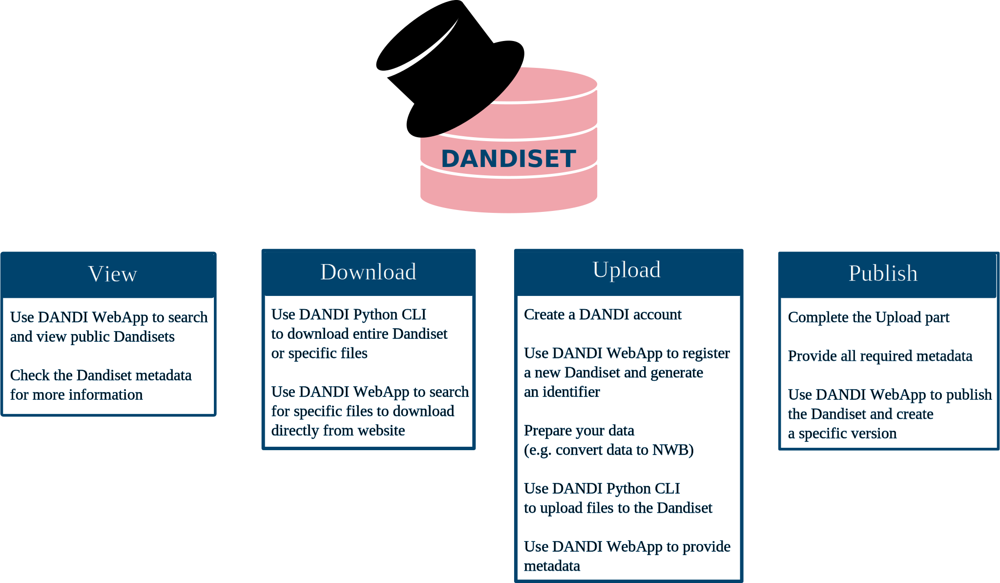

# Using DANDI

DANDI allows you to work with stored neurophysiology data in multiple ways. You can search, view, and download files,
all without registering for a DANDI account. As a registered user, you can also create these collections of data 
along with metadata and publish them to the DANDI platform. 

## Dandisets
DANDI stores cellular neurophysiology data in Dandisets.

A Dandiset is a collection of assets (files and their metadata) and metadata about the collection.

* A Dandiset is organized in a structured manner to help users and
software tools interact with it.
* Each Dandiset has a unique persistent identifier that you can use to go directly
to the Dandiset (e.g. [https://identifiers.org/DANDI:000004](https://identifiers.org/DANDI:000004)).
You can use this identifier to cite the Dandiset in your publications or provide
direct access to a Dandiset.

## Quick Start

If you are new to DANDI, all you need is an Internet connection to use the DANDI Web application to view 
and download files from a 
public 
Dandiset. 
Registration is not required.

To view a specific public Dandiset and download one of its files:

1. At the top of the DANDI Web application, click PUBLIC DANDISETS to see all Dandisets currently available in the 
   archive. You can sort them by name, identifier, or date of modification.

2. Search for a specific Dandiset by contributor name, modality, or species.

3. Click a Dandiset to open its landing page and view important information such as contact information, 
   description, license, access information and keywords, and simple statistics.

4. From the right side of the Dandiset landing page, click FILES to see a list of all folders and files for that 
   Dandiset. Click the download icon  to download a 
   specific file. 
**Note:** To download an entire Dandiset, you will need to follow the instructions in the 
   [Download](./12_download.md) section to install and use the DANDI Python client tool.

### Next steps
Although anyone on the Internet 
can view and download public Dandisets, registered users can also create Dandisets, upload data, and publish 
the Dandiset to generate a DOI for it.
See the sections that follow for more detailed information about the DANDI project, as well as instructions on how 
to work with public Dandisets or to create and publish you own as a registered user. 

## Dandiset Actions

The DANDI project contains the DANDI Web application, the DANDI Python client tool, and the DANDI JupyterHub 
instance. These tools can be used to perform actions on Dandisets. 

You can learn more about the Dandiset actions in separate sections:

- [View](./11_view.md)
- [Download](./12_download.md)
- [Upload](./13_upload.md)
- [Publish](./14_publish.md)

## Tools to interact with DANDI

### **DANDI Web application**

The [DANDI Web application](https://dandiarchive.org/) allows you to:

* Search across all public Dandisets
* Download data from public Dandisets
* Create a new Dandiset and provide metadata
* Publish your Dandiset

### **DANDI Python client**

The [DANDI Python client](https://pypi.org/project/dandi/) allows you to:

* Download Dandisets and individual subject folders or files
* Organize your data locally before upload
* Upload Dandisets

Before you can use the DANDI Python client, you have to install the package with `pip install dandi` in a Python 3.8+
environment.

You should check the [Dandi Debugging section](./15_debugging.md) in case of any problems.

### **Dandihub analysis platform**

[Dandihub](https://hub.dandiarchive.org) provides a JupyterHub instance in the cloud to interact with the data stored in DANDI.

To use the hub, you will need to register for an
account using the [DANDI Web application](https://dandiarchive.org/). 
Note that `Dandihub` is not intended for significant computation, but provides a place to introspect Dandisets and to perform some analysis and visualization of data.

## Technical limitations

- **File name/path:** There is a limit of 512 characters for the full path length within a dandiset.
- **Volume and size:** There is a limit of 5TB per file. We currently
  accept any size of standardized datasets, as long as you can upload them over
  an HTTPS connection. However, we ask you contact us if you plan to upload more than 10TB of data.

## Citing DANDI

You can add the following statement to the methods section of your manuscript.

> Data and associated metadata were uploaded to the DANDI archive [RRID:SCR_017571] using 
  the Python command line tool (https://doi.org/10.5281/zenodo.3692138). The data were first 
  converted into the NWB format (https://doi.org/10.1101/2021.03.13.435173) and  organized 
  into a BIDS-like (https://doi.org/10.1038/sdata.2016.44) structure.

You can refer to DANDI using any of the following options:

* Using an RRID [RRID:SCR_017571](https://scicrunch.org/scicrunch/Resources/record/nlx_144509-1/SCR_017571/resolver). 

* Using the DANDI CLI reference: https://doi.org/10.5281/zenodo.3692138
