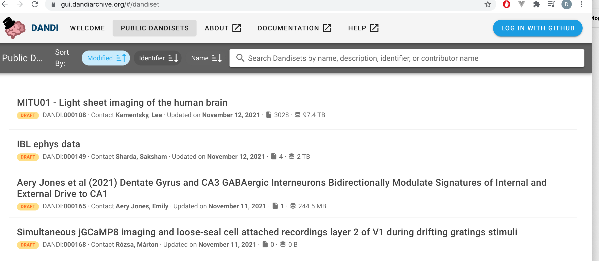
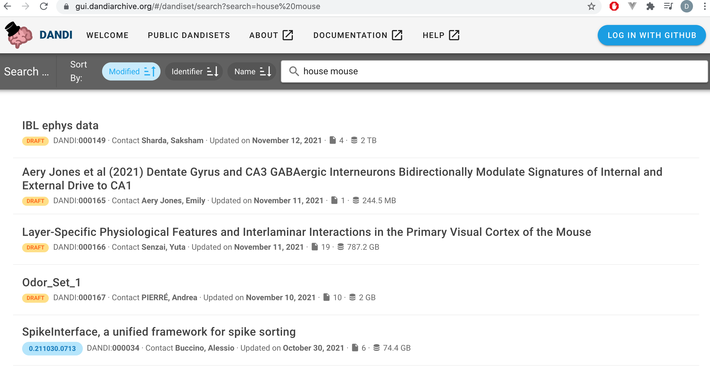
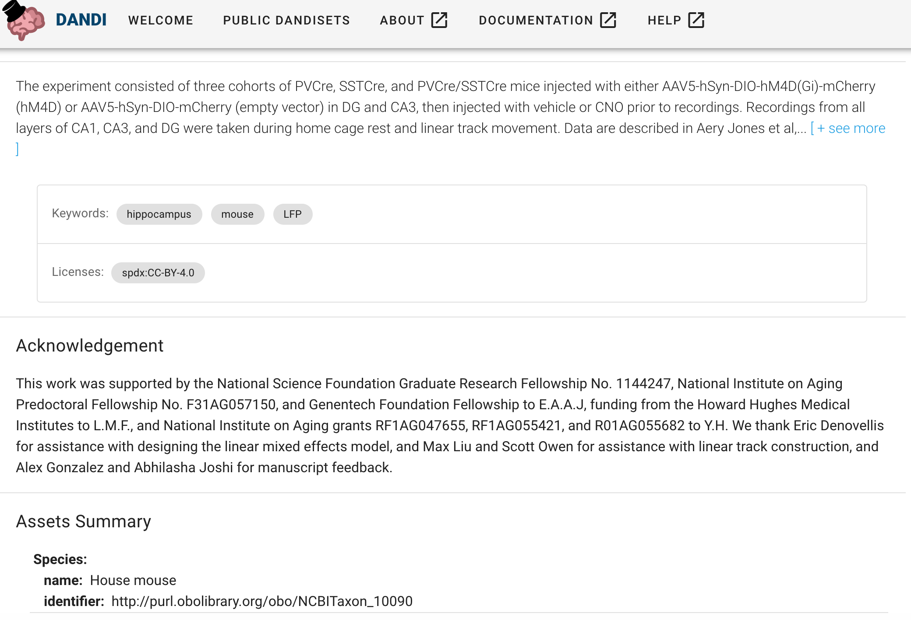
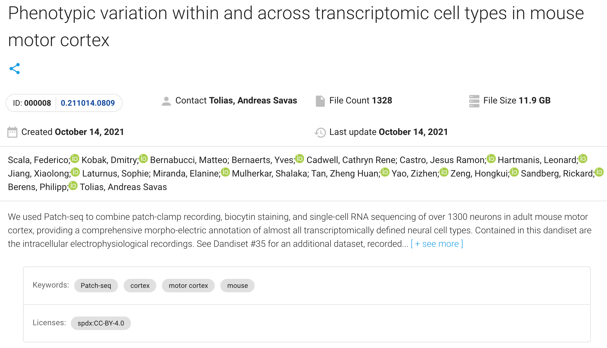
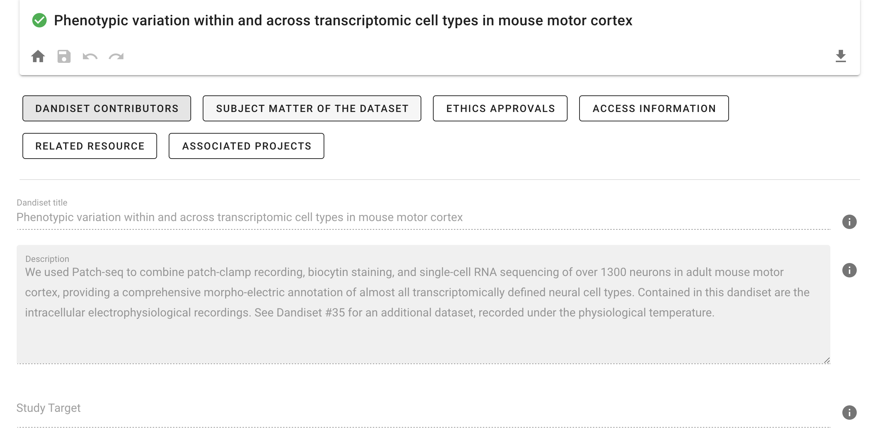

# The DANDI Archive Web

The [DANDI Archive Web application](https://dandiarchive.org/) allows you to browse 
and search across `Dandisets`. You can also create an account to register 
a new `Dandiset`, gain access to [the Dandihub analysis platform](#the-dandihub-analysis-platform), retrieve an `API key` to upload data 
to your `Dandisets, and finally publish your `Dandisets`.

#### Browse `Dandisets`
When you go the [DANDI Web application](https://dandiarchive.org/) you can click 
on `PUBLIC DANDISET` to have access to all `Dandisets` currently available 
in the archive and you can sort them  by name, identifier or date of modification. 

#### Search `Dandisets`
In addition you can search across the `Dandisets` for specific contributor name or phrase,
e.g. "house mouse", to get a subset of all `Dandisets`:

When you click on one of the `Dandisets` you can see that the searching phrase could
appear in the description, keywards, or in the assets summary.

#### `Dandisets` metadata

The landing page of each `Dandiset` contains important information including 
metadata provided by the owners such as contact information, description, license and keywords, or simple statistics for `Dandiset` such as size of the `Dandiset` and number of files.

If you scroll down, you will also find:
- Access Information
- Assets Summary
- Funding Information
- Dandiset creation date and time
- License
- Manifest Location

More detailed information you can find after choosing `Metadata` on the right side pannel. 

If you have written access this is the place where you can edit the metadata, you can also download full metadata as a jason file.

#### Using public `Dandisets`

On the right hand pannel, in addition to `Metadata`, you can find information how to cite the data and how to download the data:

You can find information how to install `dandi-cli` and how to use the software to download the data on your computer.

The right side pannel allows you also to access the list of folders and files.

