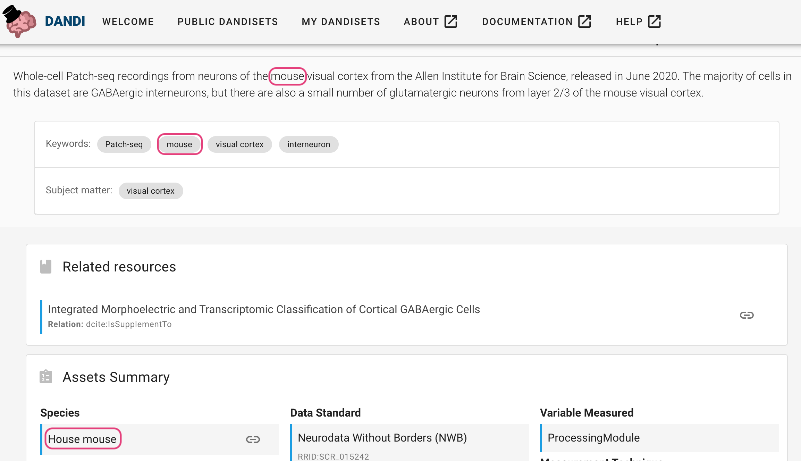
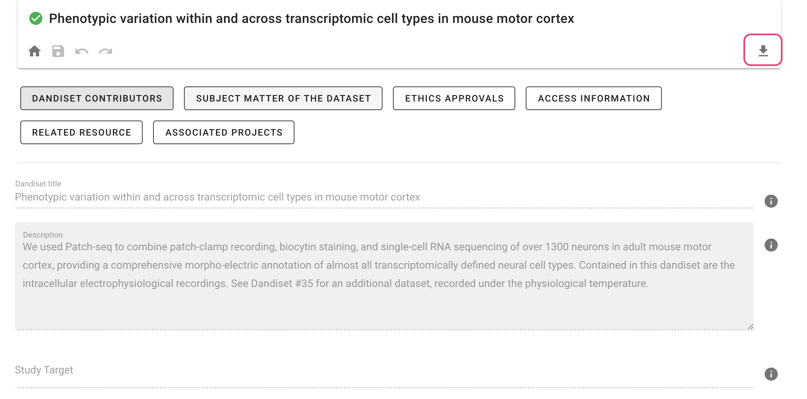

# Viewing Dandisets

## Browse Dandisets

When you go to the [DANDI Web application](https://dandiarchive.org/), you can click
on `PUBLIC DANDISET` to access all Dandisets currently available 
in the archive, and you can sort them by name, identifier, size, or date of modification.

## Search Dandisets
In addition, you can search across the Dandisets for any text part of the Dandiset metadata record. 
The text may be about contributor names, modalities, or species.  For example,  `"house mouse"` will
return a subset of all Dandisets, while `"mouse house"` will likely not return any. When unquoted each
word is used as an `OR`.

When you click on one of the Dandisets, you can see that the searching phrase can
appear in the description, keywords, or in the assets summary.

## Dandisets Metadata

The landing page of each Dandiset contains important information including 
metadata provided by the owners such as contact information, description, license, access information and keywords, 
 simple statistics for a Dandiset such as size of the Dandiset and number of files, or
 a summary of the Dandiset including information about species, techniques, and standards.

If you scroll down, you will also find:
- Assets Summary
- Funding Information
- Related Resources

While most of the metadata is summarized on the landing page, some additional information can be 
found by clicking `Metadata` on the right-side panel. For Dandiset owners, this button also allows 
adding relevant metadata to populate the landing page.

## File View

The right side panel allows you also to access a file browser to navigate the list of folders and files
in a Dandiset.

Any file in the Dandiset has a download icon
You can click this icon to download a file to your device where you are browsing
or right click to get the download URL of the file.
In addition, there is an info icon that leads to full asset metadata. Some files also have a link to external 
services that can open the file. *Note:* that these services often have size limits and hence are activated only for appropriately sized files.

## My Dandisets
If you log in as a registered user, you will also see `My Dandisets` tab:

By clicking the tab, you can access all the Dandisets you own. For these Dandisets, you can edit and update 
metadata through the Dandiset actions section, and add or remove other owners or data.
