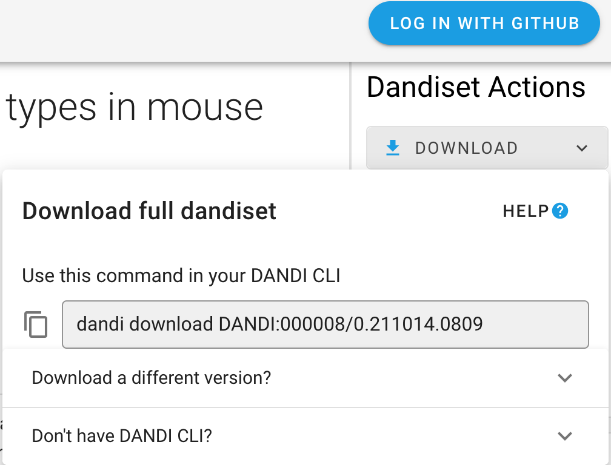

# Downloading Data and Dandisets

You can download the content of a Dandiset using the DANDI Web application (such a specific file) or entire 
Dandisets using the DANDI Python CLI.

## Using the DANDI Web Application

Once you have the Dandiset you are interested in (see more in [the Dandiset View section](./11_view.md)), you can download the content of the Dandiset.
On the landing page of each Dandiset, you can find `Download` button on the right-hand panel. After clicking the 
button, you will see the specific command you can use with DANDI Python CLI (as well as the information on how to download the CLI).

### Download specific files

The right-side panel of the Dandiset landing page allows you also to access the list of folders and files.

Each file in the Dandiset has a download icon next to it, clicking the icon will start the download process.

## Using the Python CLI Client

The [DANDI Python client](https://pypi.org/project/dandi/) gives you more options, such as downloading entire 
Dandisets.

**Before You Begin**: You need to have Python 3.8+ and install the DANDI Python Client using `pip install dandi`.
If you have an issue using the Python CLI, see the [Dandi Debugging section](./15_debugging.md).

### Download a Dandiset
To download an entire Dandiset, you can use the same command as suggested by DANDI web application, e.g.: 

`dandi download DANDI:000023`

### Download data for a specific subject from a Dandiset
You can download data for specific subjects. 
Names of the subjects can be found on DANDI web application or by running a command with the DANDI CLI: `dandi ls -r 
DANDI:000023`.
Once you have the subject ID, you can download the data, e.g.:

`dandi download https://api.dandiarchive.org/api/dandisets/000023/versions/_draft_/assets/?path=sub-811677083`

You should replace `_draft_` with a specific version you are interested in (e.g. `0.210914.1900` in the case of this Dandiset).

You can also use the link from DANDI web application, e.g.:

`dandi download https://dandiarchive.org/dandiset/000023/0.210914.1900/files?location=sub-541516760%2F`

### Download a specific file from a Dandiset 
You can download a specific file from a Dandiset when the link for the specific file can be found on the DANDI web 
application, e.g.:

`dandi download https://api.dandiarchive.org/api/dandisets/000023/versions/0.210914.1900/assets/1a93dc97-327d-4f9c-992d-c2149e7810ae/download/`

**Hint:** `dandi download` supports a number of resource identifiers to point to a Dandiset, folder, or file.  Providing 
an incorrect URL (e.g. `dandi download wrongurl`) will provide a list of supported identifiers.
