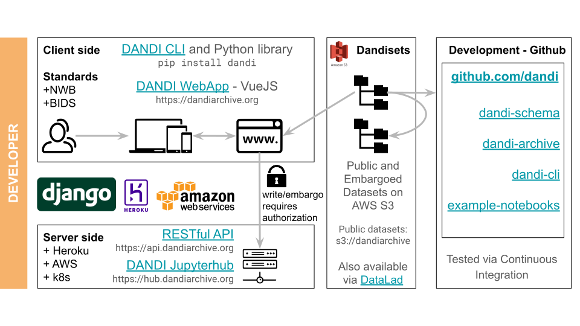

# Project Structure

The DANDI project can be represented schematically:

The **Client side** contains the DANDI Python CLI and DANDI Web application.

The **Server side** contains a RESTful API and DANDI JupyterHub.

The **`Dandiset`** is a file organization to store data together with metadata.

The DANDI project is organized around several **GitHub** repositories:

* **DANDI helpdesk.** This [repository](https://github.com/dandi/helpdesk)
  contains our community help platform. You can submit [issues](https://github.com/dandi/helpdesk/issues/new/choose)
  or [questions for discussion](https://github.com/dandi/helpdesk/discussions).

* **DANDI archive.** This [repository](https://github.com/dandi/dandi-archive)
  contains the code for deploying the client-side Web application frontend based on the [Vuejs](https://vuejs.org/)
  framework as well as a Django-based backend to run the DANDI REST API.

* **DANDI Python client.** This [repository](https://github.com/dandi/dandi-cli)
  contains the code for the command line tool used to interact with the archive. It allows you to download data from the
  archive. It also allows you to locally organize and validate your data before uploading to the archive.

* **DANDI JupyterHub.** This [repository](https://github.com/dandi/dandi-hub)
  contains the code for deploying a JupyterHub instance to support interaction with the DANDI archive.

* **DANDI schema.** This [repository](https://github.com/dandi/schema)
  provides the details and some supporting code for the DANDI metadata schema.

* **DANDI schema Python library.** This [repository](https://github.com/dandi/dandi-schema)
  provides a Python library for updating the schema and for creating and validating DANDI objects.

* **DANDI handbook.** This [repository](https://github.com/dandi/handbook)
  provides the contents of this website.

* **DANDI website.** This [repository](https://github.com/dandi/dandi.github.io)
  provides an overview of the DANDI project and the team members and collaborators.
